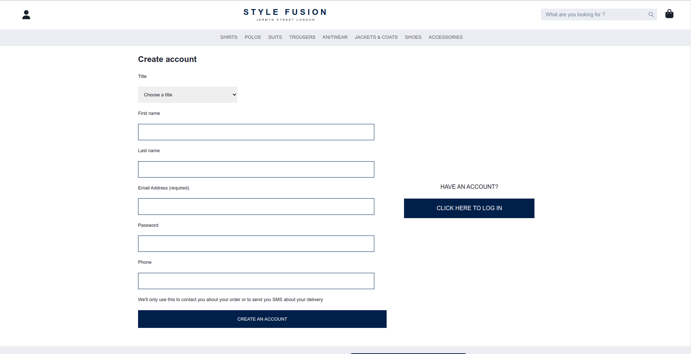
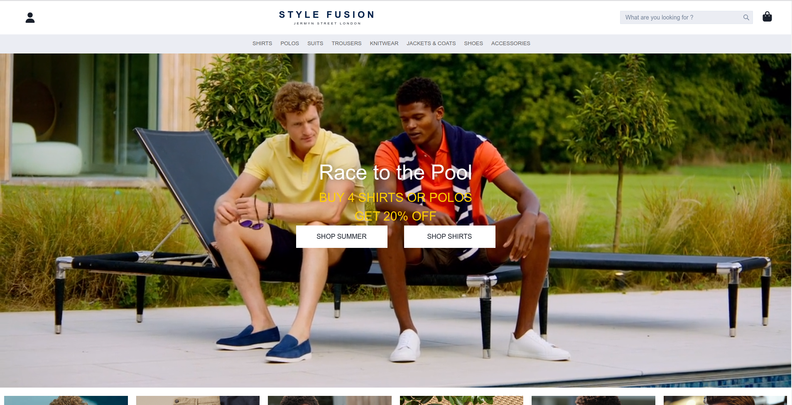
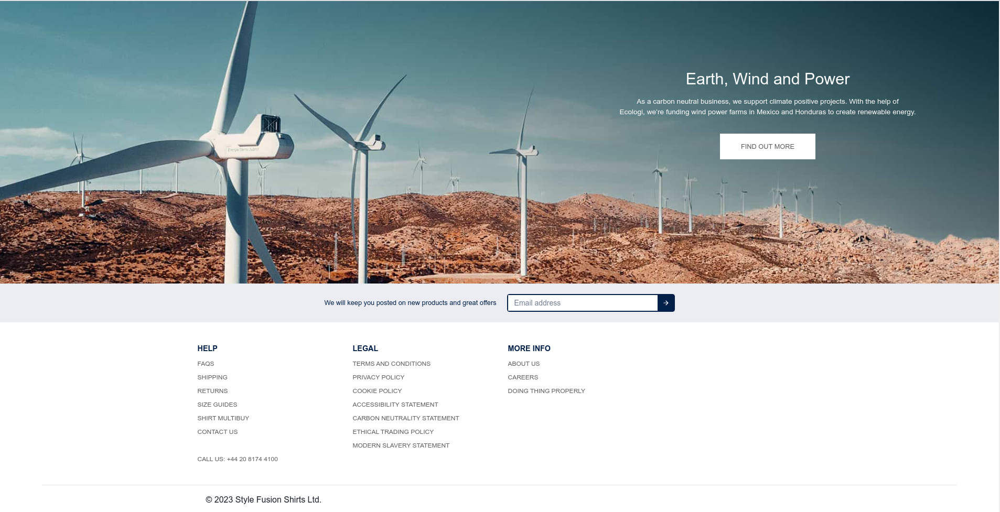

# StyleFusion : MERN Stack Clone of [charlestyrwhitt.com](https://www.charlestyrwhitt.com/)

## Overview

This repository contains a MERN (MongoDB, Express.js, React.js, Node.js) stack clone of online men's clothing store, Charles Tyrwhitt (charlestyrwhitt.com). The purpose of this project is to demonstrate the implementation of a full-stack e-commerce website, showcasing features similar to the original site.


## Features

- User registration and authentication.
- View product details, including images, price, description.
- Add products to the shopping cart and proceed to checkout.
- Manage user profiles and order history.

## Technologies Used

- **Frontend**: React.js, HTML, CSS, JavaScript.
- **Backend**: Node.js, Express.js, MongoDB, JWT for authentication.
- **Deployment**: Deployed the application on render.com .

## Screenshots

*Registration Page.*


*Login Page.*


*Home Page.*





*Products Page.*


*Product Details Page.*


*Shopping Cart and Checkout Page.*


*Order History Page.*


## Getting Started

To run this application locally, follow these steps:

1. Clone the repository:

```
git clone https://github.com/rz03/stylefusion.git
```

2. Change into the project directory:

```
cd stylefusion
```

3. Install the dependencies for both the frontend and backend:

```
cd frontend
npm install
cd ../backend
npm install
```

4. Start the development server:

   - In one terminal, run the backend server:

   ```
   cd backend
   npm run server
   ```

   - In another terminal, run the frontend development server:

   ```
   cd frontend
   npm start
   ```

6. Access the application in your web browser:

   Open your browser and navigate to `http://localhost:3000` to see the application running.
   

## Acknowledgments

- The project was inspired by the design and functionality of [charlestyrwhitt.com](https://www.charlestyrwhitt.com/).
